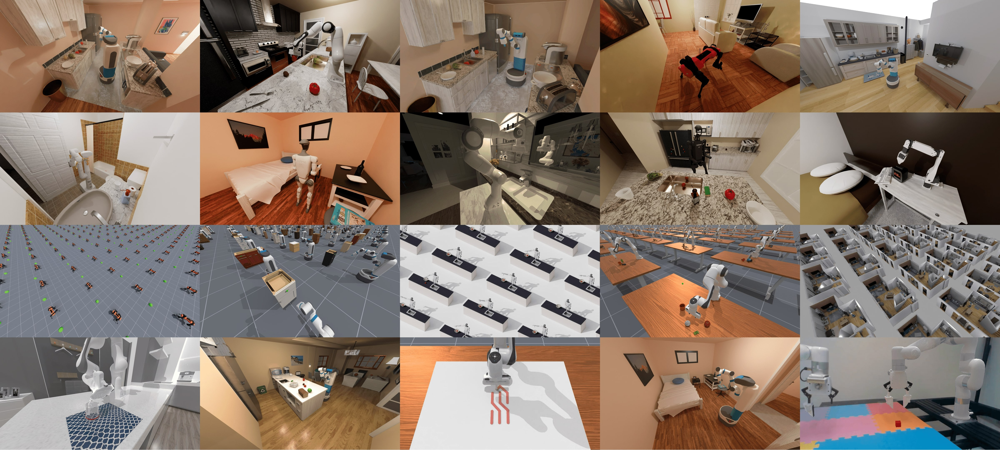

# ManiSkill 3 / Flow DP3：阿里云 PPU 运行指南



本仓库在 [ManiSkill 3](https://maniskill.readthedocs.io/en/latest/) 中独立接入 `flow_dp3`，点云编码器为 `ee_relation_pointnetpp`。第一版接入 PickCube、PushCube、StackCube、PegInsertionSide、DrawTriangle，每个任务独立训练，共用距离点云编码器和 Flow DP3 算法。任务选择、录制、训练和推理命令见 [introduce.md](introduce.md)，验证范围和后续计划见 [version.md](version.md)。下方历史示例以 PickCube 为主。

适配阿里云 PAI DSW 镜像 **`2.1.0-pytorch2.9.0-ppu-py312-cu130-ubuntu24.04`**。当前运行方式是 **CPU 物理仿真 + Mesa CPU 软件 Vulkan 渲染 + PPU 策略计算**。

## 1. 从哪里开始

| 你的情况 | 阅读位置 |
| --- | --- |
| 选择 PickCube / PushCube / StackCube / PegInsertionSide / DrawTriangle | [introduce.md：第1节任务选择与路径](introduce.md#12-选择任务配置和实验路径) |
| 已完成安装，准备录制数据、训练或评估 | [introduce.md：实验操作与参数说明](introduce.md) |
| 在新实例上安装 | 本文第3节 → 第4节 → 第5节 → introduce.md |
| 重新打开终端 | [第4节：每次启动终端](#4-每次启动终端) |
| 安装或运行时报错 | [第7节：常见问题](#7-常见问题) |
| 查看模型输入和独立实现范围 | [第6节：代码与数据约定](#6-代码与数据约定) |

README 说明项目、环境和排错；introduce.md 集中提供数据录制、训练、恢复训练、W&B、评估和 MP4 的运行命令。

## 2. 当前验证状态

| 环节 | 当前结果 |
| --- | --- |
| CPU PhysX 与真实点云 | 已通过 PickCube 环境、reset / step、软件 Vulkan 和观测适配验证 |
| PPU 编码器 | 实例已通过 `cuda:0` 前向 / 反向；设备为 PPU-ZW810E |
| 数据准备 | 工作区已有5条和20条成功末端控制示范；新实例需重新生成或单独传入数据 |
| 小模型训练与恢复 | CPU 与 PPU 均完成20次更新；CPU 10+10步恢复与连续20步结果一致 |
| 小模型闭环评估 | 可运行；现有 PPU 小模型2局、每局200步的成功率为0/2 |
| 推理视频 | 已生成并解码检查两段512×512、20 FPS 的 MP4 |
| W&B 依赖 | 安装配置固定 `wandb 0.22.3`、`protobuf 3.20.3`、`click 8.1.7`；现有环境尚未升级，新版本登录与运行待验证 |
| 完整模型 | `[512,1024,2048]` 主干的 PPU 训练效果与吞吐量尚待验证 |

以上确认了移植链路可运行。20步小模型训练用于流程检查，当前还没有收敛性能结果。历史报告和数据位于 `.runtime/`，该目录不随 Git 仓库上传。

## 3. 首次安装

下面的命令在阿里云 **DSW 实例终端** 执行。已有可用环境可以跳到第4节。

### 3.1 安装系统运行库

以 root 身份执行；普通用户在 `apt-get` 前加 `sudo`：

```bash
apt-get update
apt-get install -y libgl1 libvulkan1 vulkan-tools mesa-vulkan-drivers
```

`libgl1` 供 OpenCV 导入使用；其余包提供 Vulkan loader、检查工具和 Mesa 软件渲染。保留镜像预装的 PPU SDK、驱动及 PyTorch。

### 3.2 创建虚拟环境并保护框架版本

```bash
export MANISKILL_ROOT=/mnt/workspace/ManiSkill
cd "$MANISKILL_ROOT"
source /usr/local/PPU_SDK/envsetup.sh

/usr/local/bin/python -m venv --system-site-packages "$MANISKILL_ROOT/.venv-ppu"
source "$MANISKILL_ROOT/.venv-ppu/bin/activate"
mkdir -p .runtime

python -B - <<'PYCODE'
from importlib import metadata
from pathlib import Path
names = ['torch', 'torchvision', 'torchaudio', 'numpy', 'scipy']
pins = [f'{name}=={metadata.version(name)}' for name in names]
Path('.runtime/constraints-ppu.txt').write_text('\n'.join(pins) + '\n')
print('\n'.join(pins))
PYCODE

export PIP_CONSTRAINT="$MANISKILL_ROOT/.runtime/constraints-ppu.txt"
```

`--system-site-packages` 复用镜像的 PPU PyTorch，新增包安装到本项目虚拟环境。当前保护的版本为 torch 2.9.0、torchvision 0.24.0、torchaudio 2.9.0、NumPy 1.26.0、SciPy 1.11.3。已有约束文件的实例继续使用原文件，避免重复生成时把意外升级后的版本当成基准。

### 3.3 安装仿真、训练依赖和当前源码

```bash
pip_install_public() {
    env -u HTTP_PROXY -u HTTPS_PROXY -u ALL_PROXY \
        -u http_proxy -u https_proxy -u all_proxy \
        -u PIP_PROXY -u PIP_EXTRA_INDEX_URL \
        PIP_CONFIG_FILE=/dev/null \
        PIP_INDEX_URL=https://mirrors.aliyun.com/pypi/simple/ \
        python -m pip install \
        --index-url https://mirrors.aliyun.com/pypi/simple/ \
        --constraint "$MANISKILL_ROOT/.runtime/constraints-ppu.txt" \
        --timeout 20 --retries 1 "$@"
}

pip_install_public -r examples/baselines/flow_dp3/requirements-probe.txt
pip_install_public -r examples/baselines/flow_dp3/requirements-train.txt
pip_install_public --no-deps --no-build-isolation -e .

python -B - <<'PYCODE'
import cv2, mani_skill, torch
print('OpenCV:', cv2.__version__, cv2.__file__)
print('ManiSkill:', mani_skill.__file__)
print('PyTorch:', torch.__version__)
PYCODE

python -m pip freeze --local > .runtime/packages-local.txt
```

安装函数仅对当前命令绕过代理和 pip 配置，同时保留框架约束。固定的核心仿真依赖是 SAPIEN 3.0.3、Gymnasium 0.29.1、MPlib 0.1.1、pytorch_kinematics 0.7.6；训练新增依赖为 einops。源码安装使用 `--no-deps`，避免再次调整这些版本。

### 3.4 可选：安装 W&B

训练始终保存本地日志；需要网页曲线时再安装并登录：

```bash
pip_install_public -r examples/baselines/flow_dp3/requirements-logging.txt
wandb login
```

本镜像固定 `wandb==0.22.3`、`protobuf==3.20.3`、`click==8.1.7`。这个 SDK 版本支持 Python 3.12，允许原有 protobuf，且不依赖 OpenTelemetry。[官方依赖定义](https://github.com/wandb/wandb/blob/v0.22.3/pyproject.toml)

W&B 0.22.3 开始支持超过40字符的 API key，可使用新生成的86字符密钥。[官方发布说明](https://github.com/wandb/wandb/releases/tag/v0.22.3) 已安装旧版 `0.19.11` 的实例需重新执行本节安装命令，再执行 `wandb login --relogin`；仅修改仓库配置不会升级现有环境。安装前需在当前终端定义第3.3节的 `pip_install_public` 函数。

已经安装过 W&B 0.30.0 且出现依赖冲突的环境，按第7.3节修复后再使用。API key 在实例终端登录时输入。

## 4. 每次启动终端

完成首次安装后，新终端只需执行本节初始化，再进入 introduce.md。无需重复创建 venv 或安装包。

```bash
export MANISKILL_ROOT=/mnt/workspace/ManiSkill
cd "$MANISKILL_ROOT"
source /usr/local/PPU_SDK/envsetup.sh
source .venv-ppu/bin/activate

export PYTHONPATH="$MANISKILL_ROOT"
export PYTHONDONTWRITEBYTECODE=1
export CUDA_VISIBLE_DEVICES=0
export OMP_NUM_THREADS=1
export MKL_NUM_THREADS=1
export OPENBLAS_NUM_THREADS=1
export PIP_CONSTRAINT="$MANISKILL_ROOT/.runtime/constraints-ppu.txt"
export MS_ASSET_DIR="$MANISKILL_ROOT/.runtime/maniskill"
export MPLCONFIGDIR="$MANISKILL_ROOT/.runtime/matplotlib"

# 使用实例上真实存在的 Mesa 软件 ICD 文件。
export MANISKILL_VULKAN_ICD=/usr/share/vulkan/icd.d/lvp_icd.json
export VK_ICD_FILENAMES="$MANISKILL_VULKAN_ICD"
mkdir -p "$MPLCONFIGDIR" "$MS_ASSET_DIR" .runtime/flow_dp3
test -f "$VK_ICD_FILENAMES"
```

如果 `test -f` 失败，先查看实际文件名：

```bash
find /usr/share/vulkan/icd.d -maxdepth 1 -name '*lvp*.json' -print
```

有些系统使用 `lvp_icd.x86_64.json`。将 `MANISKILL_VULKAN_ICD` 改成实际路径，并重新设置 `VK_ICD_FILENAMES`。

## 5. 安装后的验证

先执行第4节初始化，分别确认计算、仿真和真实点云：

```bash
# CPU 模型计算。
python -B examples/baselines/flow_dp3/probe_runtime.py \
    --checks metadata torch-cpu encoder-cpu \
    --output .runtime/probe-cpu.json

# PPU 模型计算；在能访问设备的实例终端执行。
ppu-smi
python -B examples/baselines/flow_dp3/probe_runtime.py \
    --checks torch-ppu encoder-ppu \
    --output .runtime/probe-ppu.json

# CPU 物理仿真及软件 Vulkan 真实点云。
python -B examples/baselines/flow_dp3/probe_runtime.py \
    --checks sim pointcloud --render-backend cpu --steps 3 --timeout 120 \
    --output .runtime/probe-sim-pointcloud.json
```

每项检查在独立子进程中运行，任何所选项失败时退出码为1。编码器检查包含前向、反向和有限梯度；点云检查包含相机有效点、坐标变换、裁剪、采样及关系编码器输出。`--steps` 在这里表示环境步数，`--timeout` 是每项检查的超时秒数。

全部通过后，按 [introduce.md](introduce.md) 进行数据准备、完整模型训练和评估。可额外执行仓库测试：

```bash
python -B -m unittest discover -s examples/baselines/flow_dp3/tests -v
```

安装 W&B 后，测试中的 `test_real_sdk_offline` 会创建真实离线日志，无需登录。工具沙箱限制后台服务所需的 socket；这项测试应以实例终端结果为准。

## 6. 代码与数据约定

```text
ManiSkill/
├── README.md                         # 项目、环境与排错
├── introduce.md                      # 实验命令、参数与结果位置
├── mani_skill/                       # 仿真框架
├── examples/baselines/flow_dp3/
│   ├── ee_relation_encoder.py        # ee_relation_pointnetpp
│   ├── obs_adapter.py                # 采集和评估共享的观测适配器
│   ├── prepare_demos.py              # 原始轨迹生成、回放、成功过滤
│   ├── dataset.py                    # episode 划分与序列窗口
│   ├── policy.py / conditional_unet1d.py
│   ├── train.py / evaluate.py        # 训练、恢复、闭环评估与录像
│   ├── experiment_logging.py / import_training_logs.py
│   ├── repair_logging_env.py         # 已知 W&B 依赖冲突修复
│   ├── configs/                     # 小模型与完整模型
│   ├── requirements-*.txt / tests/
│   └── PROVENANCE.md / LICENSE-DP3
├── .venv-ppu/                        # 本机环境，不上传
└── .runtime/                         # 数据、权重、日志、视频，不上传
```

FlowDP3 在本仓库独立运行，不导入参考 benchmark，不共用其环境或 checkpoint。移植范围、算法来源与许可证见 [PROVENANCE.md](examples/baselines/flow_dp3/PROVENANCE.md)。

| 输入 / 输出 | 约定 |
| --- | --- |
| 点云 | 每帧 `[512,4]`；前三通道为 `(基座系点坐标 − 基座系末端坐标) / L`，第四通道为相对位移模长 `/ L` |
| 状态 | 28维：qpos 9、qvel 9、基座系末端位姿7（四元数 wxyz）、基座系目标位置3 |
| 动作 | 4维 `pd_ee_delta_pos`：标准化末端 xyz 增量及夹爪动作，范围 `[-1,1]` |
| 时间窗口 | 默认2帧观测、16步动作预测、每次执行8步动作 |
| 仿真 / 相机 | 单环境 CPU PhysX；PickCube 点云相机 256×256、60°，世界位置 `(0.30,-0.30,0.35)`、注视 `(0,0,0.12)`；软件 Vulkan |

相机原生 `xyzw` 的第四通道是有效点标记，适配器会重新构造距离通道。处理顺序为有效点过滤 → 世界系转基座系 → 操作区裁剪 → 预采样4096点 → FPS → 相对末端特征。默认 PickCube crop 为基座系 `min=(0.44,-0.23,-0.03)`、`max=(0.79,0.25,0.52)` 米，优先保留目标与末端，允许裁掉部分机械臂，排除背景地面。点数不足直接报错；点云不做逐通道 min-max 或每帧中心化。

任务相机和 [scene_bounds.py](examples/baselines/flow_dp3/scene_bounds.py) 共用 [task_pointcloud.py](mani_skill/utils/task_pointcloud.py) 的配置。FPS 的512点是整个裁剪后场景的总数，包含桌面/画布。分类通过渲染器的实体 segmentation ID 与采样索引核对，仅用于诊断，不参与模型采样。下表的相机位置与注视点是世界坐标，crop是基座坐标，均以米为单位；五台基座相机均为256×256，Peg保留原腕部相机。相机调整针对实验使用的Panda/PandaWristCam/PandaStick；其他机器人不套用这些操作区。

| 任务 | 基座系 crop 下界 | 基座系 crop 上界 | 世界系 eye → target | 垂直视场角 |
| --- | --- | --- | --- | --- |
| PickCube-v1 | `(0.44,-0.23,-0.03)` | `(0.79,0.25,0.52)` | `(0.30,-0.30,0.35)` → `(0,0,0.12)` | 60° |
| PushCube-v1 | `(0.40,-0.23,-0.03)` | `(1.06,0.25,0.52)` | `(0.30,-0.30,0.35)` → `(0.15,0,0.08)` | 75° |
| StackCube-v1 | `(0.36,-0.36,-0.03)` | `(0.87,0.36,0.52)` | `(0.30,0.35,0.28)` → `(0,0,0.07)` | 65° |
| PegInsertionSide-v1 | `(0.34,-0.40,-0.03)` | `(0.90,0.62,0.52)` | `(0.30,-0.35,0.55)` → `(0,0.10,0.12)` | 75° |
| DrawTriangle-v1 | `(0.28,-0.35,-0.03)` | `(0.80,0.18,0.52)` | `(0.25,-0.40,0.50)` → `(-0.10,-0.10,0.04)` | 60° |

点云接口可通过 `pointcloud_features(obs, agent, env_id="PegInsertionSide-v1")` 选择任务预设；显式传入的 `ObservationConfig` 优先，Draw支持PandaStick的TCP link。实验中可见目标在crop阶段全部保留，但整臂可能被裁去，后续预采样与FPS仍会丢失目标点。例如Pick原始方块中位数476点，FPS后11点；Draw仍有3/700帧目标轮廓被FPS完全丢弃。完整对照及取舍见 [实验报告](testpointcloud/MULTI_TASK_REPORT.md)。第一版正式数据转换与推理已接入这五个任务；状态/动作维度和运行命令见 [introduce.md](introduce.md)。

Stack实验录制显式使用`robot_uids="panda"`；任务原有默认机器人`panda_wristcam`保持不变，其`hand_camera`也保留。默认机器人拼接两台相机时，点数分布不能直接套用单相机实验表。

新训练和可视化默认使用 `pickcube-100-camera-v5.h5`。数据契约v2同时记录crop、相机pose（wxyz）、分辨率、视场角、裁剪面及shader，评估和视频回放按记录的参数创建环境。旧v1契约显式恢复原128×128相机及旧crop；旧HDF5/checkpoint不会自动变成新观测。使用新配置需重新转换原始轨迹并开始新训练，命令见 [introduce.md](introduce.md) 第2节。

训练和验证按整条 episode 划分，状态与动作归一化只使用训练 episode。模型输入包含任务目标位置；物体真值位姿、抓取状态和成功标记仅用于环境或数据检查。PickCube 正式配置、烟雾配置及策略缺省的 SA1/SA2 半径为 0.05 / 0.12 米，依据见 [半径实验](testpointcloud/SA_RADIUS_REPORT.md)，成功率仍需新训练验证。现有点云数据可复用；旧 checkpoint 按保存的半径加载。其他任务配置暂保留 0.10 / 0.20 米。

## 7. 常见问题

### 7.1 导入失败或依赖警告

| 消息 | 处理 |
| --- | --- |
| `ImportError: libGL.so.1` | 执行第3.1节安装 `libgl1`，再检查 `import cv2` 和 `import mani_skill`。 |
| `Name or service not known` / 代理连接失败 | 检查实例网络和安装源。其后的 `No matching distribution found` 可能由网络失败引起。 |
| `Not uninstalling ... outside environment` | venv 继承系统包时的正常保护提示；是否有冲突要看后面的版本信息。 |
| `RequestsDependencyWarning` | 当前环境存在 Requests 与 chardet 版本警告；与仿真、Vulkan 错误分开排查。 |
| `pip check` 列出冲突 | 它会检查全部继承包。镜像原有冲突不一定是本次安装造成的，应核对涉及的版本和实际功能。 |

基础镜像的 `opencv-python-headless 4.13` 声明需要 NumPy ≥2，但本项目实际使用 venv 中的 `opencv-python 4.11` 与 NumPy 1.26.0。两种发行包共享 `cv2` 命名空间，后续调整要确认实际导入路径。[OpenCV 说明](https://pypi.org/project/opencv-python/)

### 7.2 仿真、渲染与设备可见性

| 消息 / 场景 | 处理 |
| --- | --- |
| `failed to find a rendering device` | 相机运行先确认 Mesa ICD 文件和 `VK_ICD_FILENAMES`，执行 `vulkaninfo --summary` 与第5节点云检查。 |
| 无渲染 sim 检查仍创建材质 | 本仓库已在 `build_cube()` / `build_sphere()` 中按 `scene.can_render()` 跳过视觉创建；其他任务需单独验证。 |
| `Failed to find Vulkan ICD file` / glvnd 警告 | SAPIEN 可能将 PPU 的 `nvidia-smi` 兼容命令当作 NVIDIA 环境；显式选择实际 Mesa ICD。 |
| GPU Vulkan `ErrorIncompatibleDriver` | 本实例继续使用已经通过的 CPU 软件渲染。 |
| `当前进程无法访问 PPU` | 在实例终端初始化 SDK，检查 `ppu-smi` 和设备挂载；也可显式 `--device cpu` 检查模型流程。 |

`cuda:0` 和 `nvidia-smi` 是 PPU 镜像兼容接口，不能证明 NVIDIA 图形能力。模型计算、物理仿真和相机渲染需要分别验证；当前 CPU 渲染通过不代表 PPU Vulkan 已可用。[ManiSkill 安装文档](https://maniskill.readthedocs.io/en/latest/user_guide/getting_started/installation.html)

### 7.3 W&B 0.30.0 依赖冲突

此修复适用于此前安装导致的本地 OpenTelemetry 1.45.0 / 0.66b0 覆盖、protobuf 7.36.2 和 click 8.5.0。已经修复成功且 W&B 为 `0.22.3` 的实例无需重复执行；此前修复为 `0.19.11` 的实例按第3.4节升级即可。

```bash
python -B examples/baselines/flow_dp3/repair_logging_env.py --dry-run
python -B examples/baselines/flow_dp3/repair_logging_env.py
```

脚本限制在本项目 `.venv-ppu` 执行，先检查核心依赖及覆盖版本，下载齐所有 wheel 后才安装固定版本、移除已确认的8个本地 OpenTelemetry 覆盖包。下载失败不更改已安装包；系统目录保留原包。默认阿里云镜像，必要时可添加 `--index-url https://pypi.org/simple/`。

成功报告在 `.runtime/wandb-dependency-repair/last-success.json`。镜像原有 OpenTelemetry / grpcio-reflection 与 TensorBoardX / Google API 的 protobuf 要求无法全部同时满足，因此修复后 `pip check` 仍可能报告原有冲突。本项目选用兼容原 protobuf、无需 OpenTelemetry 的 W&B。

### 7.4 数据和实验输出已存在

数据输出、评估报告和同名视频拒绝覆盖；新训练输出目录必须为空。换一个实验编号或输出文件名。继续同一次训练使用 `--resume`，写回原目录，并保持配置、数据、batch size 和计算设备类型一致。具体命令见 introduce.md。

`.venv-ppu/`、`.runtime/`、权重和本地日志已被 `.gitignore` 排除。新实例需按文档重建环境，数据和 checkpoint 另行保存或传输。

## 8. 上游资料与引用

- [ManiSkill 官方文档](https://maniskill.readthedocs.io/en/latest/) 与 [示例](https://maniskill.readthedocs.io/en/latest/user_guide/demos/index.html)
- [ManiSkill3 论文](https://arxiv.org/abs/2410.00425)
- [DP3 论文](https://arxiv.org/abs/2403.03954) 与 [项目](https://3d-diffusion-policy.github.io/)
- [FlowDP3 移植来源](examples/baselines/flow_dp3/PROVENANCE.md) 与 [DP3 许可证](examples/baselines/flow_dp3/LICENSE-DP3)

使用 ManiSkill3 时引用：

```bibtex
@article{taomaniskill3,
  title={ManiSkill3: GPU Parallelized Robotics Simulation and Rendering for Generalizable Embodied AI},
  author={Stone Tao and Fanbo Xiang and Arth Shukla and Yuzhe Qin and Xander Hinrichsen and Xiaodi Yuan and Chen Bao and Xinsong Lin and Yulin Liu and Tse-kai Chan and Yuan Gao and Xuanlin Li and Tongzhou Mu and Nan Xiao and Arnav Gurha and Viswesh Nagaswamy Rajesh and Yong Woo Choi and Yen-Ru Chen and Zhiao Huang and Roberto Calandra and Rui Chen and Shan Luo and Hao Su},
  journal={Robotics: Science and Systems},
  year={2025}
}
```

ManiSkill 代码见 [LICENSE](LICENSE)，资产与第三方组件分别遵循其许可证，参见 [LICENSE-3RD-PARTY](LICENSE-3RD-PARTY)。
